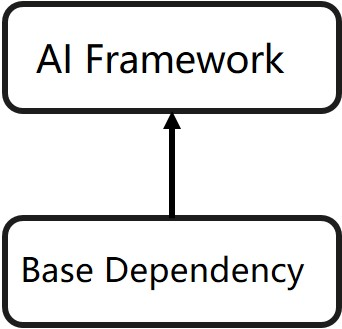

# 构建ASCEND的开发态镜像
## 简介
基于镜像树结构来构建容器镜像，具有可扩展性。推理镜像树示意图如图1所示。



表1 昇腾基础镜像树说明
| 镜像名       | 说明        |
|:-----------:| :-------------:|
|Base Dependency|安装系统底层依赖以及cann toolkit等。|
|AI Framework |AI框架层|

## 前提条件
- 容器场景，需用户自行安装docker（版本要求大于等于18.03）。
- 容器OS镜像可从Docker Hub拉取。
- **下述步骤中用到的cann toolkit,MindStudio,tfplugin,python以及pytorch,tensorflow和mindspore都有对应的版本关系，需要用户核实好版本对应关系，否则可能会安装失败或者启动不了。MindStudio与CANN的对应关系见[链接](https://www.hiascend.com/document/detail/zh/mindstudio/50RC3/releasenote/releasenote_000001.html)。CANN与对应的驱动及框架版本的对应关系见[链接](https://support.huawei.com/enterprise/zh/ascend-computing/ascend-data-center-solution-pid-251167910)**

## 构建基础镜像步骤
1.以root用户登录服务器。

2.构建镜像Base Dependency。

a.进入Dockerfile所在路径（请根据实际路径修改）。
```
cd Dockerfile/latest/MindStudio/common/ascendbase-develop/{os}-{arch}
```
其中{os}表示容器镜像操作系统版本，{arch}表示架构，请根据实际情况替换。

b.请在当前目录准备以下文件
表2 所需文件

| 文件       | 说明     | 获取方法        |
|:-----------:| :-------------:| :-------------:|
|Dockerfile|制作镜像需要。|已存在于当前目录。用户可根据实际需要自行定制。 |
|Ascend-cann-toolkit_{version}_linux-{arch}.run|cann toolkit包|由用户自行准备,见[链接](https://www.hiascend.com/document/detail/zh/canncommercial/60RC1/envdeployment/instg/instg_000018.html) |
|MindStudio_{version}_linux.tar.gz|MindStudio包|由用户自行准备,见[链接](https://www.hiascend.com/software/mindstudio/download) |

**注意：cann toolkit和mindstudio有版本对应关系。**

c.在当前目录执行以下命令构建镜像ascend-base。
```
docker build -t base_name:base_TAG --build-arg CANN_TOOLKIT_PKG=toolkit-name --build-arg MINDSTUDIO_PKG=mindstudio_name --build-arg PY_VERSION=py_version .
```
注意不要遗漏命令结尾的“.”，命令解释如表3所示

表3 命令参数说明
| 参数       | 说明        |
|:-----------:| :-------------:|
|base_name:base_TAG|镜像名与标签，建议将base_TAG命名为“软件包版本-容器OS-架构”（例如“20.2.rc1-ubuntu18.04-arm64”）。|
|--build-arg | 指定dockerfile文件内的参数。|
| CANN_TOOLKIT_PKG|toolkit-name为cann toolkit包名称，注意不要遗漏后缀，请用户自行更换。 |
| MINDSTUDIO_PKG|mindstudio_name为mindstudio包，注意不要遗漏后缀，请用户自行更换。|
|PY_VERSION|py_version为容器内要安装的python版本，请用户自行更换|

如需在此步骤配置系统网络代理，命令参考如下：

```
docker build -t base_name:base_TAG --build-arg CANN_TOOLKIT_PKG=toolkit-name --build-arg MINDSTUDIO_PKG=mindstudio_name --build-arg PY_VERSION=py_version --build-arg http_proxy=http://proxyserverip:port --build-arg https_proxy=http://proxyserverip:port .
```
其中proxyserverip为代理服务器的ip地址，port为端口。

当出现“Successfully built xxx”表示镜像构建成功。
d.构建完成后，执行以下命令查看镜像信息。
```
docker images
```

# 基于基础镜像构建AI框架层
1.以root用户登录服务器。

2.构建镜像AI Framework。

a.进入Dockerfile所在路径（请根据实际路径修改）。

```
cd Dockerfile/latest/MindStudio/modelzoo/ascend-{framework}/{arch}
```
其中{framework}表示AI框架，{arch}表示架构，请根据实际情况替换。

### pytorch框架
需要在对应的{arch}目录下准备如下文件

表4 构建pytorch所需文件
| 文件       | 说明     | 获取方法        |
|:-----------:| :-------------:| :-------------:|
|Dockerfile|制作镜像需要。|已存在于当前目录。用户可根据实际需要自行定制。 |
|torch-{version}+ascend.post5.**-linux_{arch}.whl| torch包 | 获取[链接](https://www.hiascend.com/software/ai-frameworks/commercial)| 
|apex-0.1+ascend.**-linux_{arch}.whl|torch apex包|获取[链接](https://www.hiascend.com/software/ai-frameworks/commercial)|

其中{version}表示torch版本，{arch}表示架构，与基础镜像中的cann toolkit包有版本对应关系，请根据实际情况替换。

**x86_64**架构在当前目录执行以下命令构建torch镜像torchenv。
```shell
docker build -t torch_name:torch_TAG --build-arg BASE_NAME=base_name --build-arg BASE_VERSION=base_version --build-arg TORCH_PKG=torch_pkg --build-arg APEX_PKG=apex_pkg --build-arg TV_VERSION=tv_version .
```
**aarch**架构在当前目录执行以下命令构建torch镜像torchenv。
```shell
docker build -t torch_name:torch_TAG --build-arg BASE_NAME=base_name --build-arg BASE_VERSION=base_version --build-arg TORCH_PKG=torch_pkg --build-arg APEX_PKG=apex_pkg --build-arg TV_VERSION=tv_version .
```
注意不要遗漏命令结尾的“.”,命令解释如表5所示

表5 命令参数说明
| 参数       | 说明        |
|:-----------:| :-------------:|
|torch_name:torch_TAG|镜像名与标签，建议将torch_TAG命名为“软件包版本-容器OS-架构”（例如“20.2.rc1-ubuntu18.04-arm64”）。|
|--build-arg | 指定dockerfile文件内的参数。|
| BASE_NAME|base_name为基础镜像名称，请用户自行更换。 |
| BASE_VERSION| base_version为基础镜像的镜像标签，请用户自行更换。|
| TORCH_PKG| torch_pkg为torch包名称，请用户自行更换，注意不要遗漏后缀。|
| APEX_PKG| apex_pkg为apex包名称，请用户自行更换，注意不要遗漏后缀。|
| TV_VERSION| pytorch对应的torchvision的版本，有版本对应关系。pytorch v1.5.0对应torchvision==0.6.0，PyTorch 1.8.1需安装0.9.1版本，PyTorch 1.11.0需安装0.12.0版本|

当出现“Successfully built xxx”表示镜像构建成功。

### tensorflow框架
需要在对应的{arch}目录下准备如下文件
表6 构建tensorflow所需文件
| 文件       | 说明     | 获取方法        |
|:-----------:| :-------------:| :-------------:|
|Dockerfile|制作镜像需要。|已存在于当前目录。用户可根据实际需要自行定制。 |
|Ascend-cann-tfplugin_{version}_linux-{arch}.run| tfplugin插件包，与基础镜像包的cann toolkit有版本对应关系 | 获取[链接](https://www.hiascend.com/document/detail/zh/canncommercial/60RC1/envdeployment/instg/instg_000018.html)| 
|ascend_install.info|软件包安装日志文件|（从host拷贝“/etc/ascend_install.info”文件。以实际路径为准。请注意拷贝到当前目后，将拷贝文件内的“UserName”和“UserGroup”这两行内容删除。 |
|version.info|driver包版本信息文件|从host拷贝“/usr/local/Ascend/driver/version.info”文件。以实际路径为准。|
|TF_PKG|tensorflow包|aarch架构需要用户自己准备包,见[链接](https://www.hiascend.com/document/detail/zh/canncommercial/60RC1/envdeployment/instg/instg_000034.html)，x86_64架构传入tensorflow版本号即可,目前x86_64仅支持1.15和2.6版本|

其中{version}表示插件包版本，{arch}表示架构，与基础镜像中的cann toolkit包有版本对应关系，请根据实际情况替换。

TensorFlow1.15配套的Python版本是：Python3.7.x（3.7.5~3.7.11）。
TensorFlow2.6.5配套的Python版本是：Python3.7.x（3.7.5~3.7.11）、Python3.8.x（3.8.0~3.8.11）、Python3.9.x（3.9.0~3.9.2）

**x86_64**架构在当前目录执行以下命令构建tensorflow镜像tensorflowenv。
```shell
docker build -t tenforflow_name:tenforflow_TAG --build-arg BASE_NAME=base_name --build-arg BASE_VERSION=base_version --build-arg TF_VERSION=tf_version --build-arg TFPLUGIN_PKG=tfplugin_pkg .
```
**aarch**架构在当前目录执行以下命令构建tensorflow镜像tensorflowenv。
```shell
docker build -t tenforflow_name:tenforflow_TAG --build-arg BASE_NAME=base_name --build-arg BASE_VERSION=base_version --build-arg TF_PKG=tf_pkg --build-arg TFPLUGIN_PKG=tfplugin_pkg .
```
注意不要遗漏命令结尾的“.”,命令解释如表7所示
表7 命令参数说明
| 参数       | 说明        |
|:-----------:| :-------------:|
|tensorflow_name:tensorflow_TAG|镜像名与标签，建议将tensorlfow_TAG命名为“软件包版本-容器OS-架构”（例如“20.2.rc1-ubuntu18.04-arm64”）。|
|--build-arg | 指定dockerfile文件内的参数。|
| BASE_NAME|base_name为基础镜像名称，请用户自行更换。 |
| BASE_VERSION| base_version为基础镜像的镜像标签，请用户自行更换。|
| TF_VERSION| tf_version为tensorflow版本，请用户自行更换,注意tf版本与cann包及python有版本对应关系。|
| TFPLUGIN_PKG| tfplugin_pkg为tfplugin包名称，请用户自行更换，注意不要遗漏后缀。|

当出现“Successfully built xxx”表示镜像构建成功。

### mindspore框架
需要在对应的{arch}目录下准备如下文件

表8 构建mindspore所需文件
| 文件       | 说明     | 获取方法        |
|:-----------:| :-------------:| :-------------:|
|Dockerfile|制作镜像需要。|已存在于当前目录。用户可根据实际需要自行定制。 |

在当前目录执行以下命令构建mindspore镜像mindsporeenv。
```shell
docker build -t mindspore_name:mindspore_TAG --build-arg BASE_NAME=base_name --build-arg BASE_VERSION=base_version --build-arg MS_VERSION=ms_version .
```
注意不要遗漏命令结尾的“.”,命令解释如表9所示

表9 命令参数说明
| 参数       | 说明        |
|:-----------:| :-------------:|
|mindspore_name:mindspore_TAG|镜像名与标签，建议将mindspore_TAG命名为“软件包版本-容器OS-架构”（例如“20.2.rc1-ubuntu18.04-arm64”）。|
|--build-arg | 指定dockerfile文件内的参数。|
| BASE_NAME|base_name为基础镜像名称，请用户自行更换。 |
| BASE_VERSION| base_version为基础镜像的镜像标签，请用户自行更换。|
| MS_VERSION| ms_version为mindspore版本，请用户自行更换,注意mindspore版本与cann包及python有版本对应关系。|

当出现“Successfully built xxx”表示镜像构建成功。


其中{mindspore_name:mindspore_TAG}为构建的mindspore镜像名称和标签。

## 从镜像启动容器和MindStudio
**第一次启动容器时**
从pytorch或者tensorflow或者mindspore镜像启动，需要映射宿主机的昇腾加速卡到容器，命令如下
```
docker run -it -u root --ipc=host \
--device=/dev/davinci0 \
--device=/dev/davinci1 \
--device=/dev/davinci2 \
--device=/dev/davinci3 \
--device=/dev/davinci4 \
--device=/dev/davinci5 \
--device=/dev/davinci6 \
--device=/dev/davinci7 \
--device=/dev/davinci_manager \
--device=/dev/devmm_svm \
--device=/dev/hisi_hdc \
-v /usr/local/Ascend/driver:/usr/local/Ascend/driver \
-v /usr/local/Ascend/add-ons/:/usr/local/Ascend/add-ons/ \
-v /usr/local/sbin:/usr/local/sbin \
-v /var/log/npu/conf/slog/slog.conf:/var/log/npu/conf/slog/slog.conf \
-v /var/log/npu/slog/:/var/log/npu/slog \
-v /var/log/npu/profiling/:/var/log/npu/profiling \
-v /var/log/npu/dump/:/var/log/npu/dump \
-v /var/log/npu/:/usr/slog \
-p {host_port:container_port} \
{image_name:image_TAG} \
/bin/bash
```
其中{host_port:container_port}代表端口映射关系，host_port表示宿主机上未被占用的端口，container_port表示容器内ssh的端口，默认是22；{image_name:image_TAG}代表镜像名：镜像TAG。命令中默认挂载0-7张卡到容器中，可根据实际需要挂载device。
进入容器后，启动ssh服务和设置登录的root用户及密码，命令如下：
```shell
service ssh start
```
修改root用户密码命令
```shell
passwd
```
最后通过mobaXterm或者xshell等工具连接容器。命令如下：
```shell
ssh -p host_port root@ip
```
**非第一次启动容器时**
通过如下命令找到对应容器的ID
```shell
docker ps -a
```
确保容器是启动状态，再通过如下命令进入容器
```shell
docker exec -it {container ID} /bin/bash
```
container ID是需要进入的容器ID.

**进入容器后通过配置ssh服务，设置密码，下次只要保证这个容器start的状态，就可以直接通过用户密码登录**

### 启动MindStudio
需要通过ssh登录容器，找到对应目录，启动命令：
```shell
sh mindstudio.sh
```
