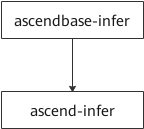
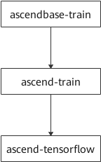

# 构建推理容器镜像
 ##  简介
基于镜像树结构来构建容器镜像，具有可扩展性。推理镜像树示意图如图1所示。



表1 昇腾基础镜像树说明
| 镜像名       | 说明        |
|:-----------:| :-------------:|
|ascendbase-infer|安装系统组件等。|
|ascend-infer |安装离线推理引擎包nnrt等。|

## 前提条件
- 容器场景，需用户自行安装docker（版本要求大于等于18.03）。
- 容器OS镜像可从Docker Hub拉取。
- 宿主机已安装驱动和固件，安装操作可参考[《CANN 软件安装指南》](https://www.hiascend.com/document/detail/zh/canncommercial/51RC2/envdeployment/instg)。

## 构建推理镜像步骤
1.以root用户登录服务器。
2.构建镜像ascendbase-infer。

a.进入Dockerfile所在路径（请根据实际路径修改）。
```
cd Dockerfile/latest/common/ascendbase-infer/{os}-{arch}
```
其中{os}表示容器镜像操作系统版本，{arch}表示架构，请根据实际情况替换。

b.请在当前目录准备以下文件

表2 所需文件

| 文件       | 说明     | 获取方法        |
|:-----------:| :-------------:| :-------------:|
|Dockerfile|制作镜像需要。|已存在于当前目录。用户可根据实际需要自行定制。 |
|EulerOS.repo | yum源配置文件。 | 仅容器镜像OS为EulerOS2.8时需准备。| 
|libstdc++.so.6.0.24|动态库文件。|仅当容器镜像OS为CentOS时需要准备libstdc++.so.6.0.24文件。可以通过find命令查询libstdc++.so.6.0.24文件所在路径，然后从host拷贝。|

c.在当前目录执行以下命令构建镜像ascendbase-infer。
```
docker build -t ascendbase-infer:base_TAG .
```
注意不要遗漏命令结尾的“.”，命令解释如表3所示。
如需在此步骤配置系统网络代理，命令参考如下：
```
docker build -t ascendbase-infer:base_TAG --build-arg http_proxy=http://proxyserverip:port --build-arg https_proxy=http://proxyserverip:port .
```
其中proxyserverip为代理服务器的ip地址，port为端口。

表3 命令参数说明
| 参数       | 说明        |
|:-----------:| :-------------:|
|ascendbase-infer:base_TAG|镜像名称与标签，建议将base_TAG命名为“日期-容器OS-架构”（例如“20210106-ubuntu18.04-arm64”）。|

当出现“Successfully built xxx”表示镜像构建成功。

4.基于镜像ascendbase-infer，构建镜像ascend-infer。
a.进入Dockerfile所在路径（请根据实际路径修改）。
```
cd Dockerfile/latest/common/ascend-infer
```
b.请在当前目录准备以下软件包和相关文件。

表4 所需软件或文件
| 软件或文件       | 说明     | 获取方法        |
|:-----------:| :-------------:| :-------------:|
|Ascend-cann-nnrt_{version}_linux-{arch}.run|离线推理引擎包。其中{version}表示软件包版本，{arch}表示架构。 |[获取链接](https://www.hiascend.com/software/cann/commercial) |
|Dockerfile |制作镜像需要。|已存在于当前目录。用户可根据实际需要自行定制。 |
|ascend_install.info |软件包安装日志文件 | （从host拷贝“/etc/ascend_install.info”文件。以实际路径为准。请注意拷贝到当前目后，将拷贝文件内的“UserName”和“UserGroup”这两行内容删除。|
|version.info | driver包版本信息文件 | 从host拷贝“/usr/local/Ascend/driver/version.info”文件。以实际路径为准。| 

c.在当前目录执行以下命令构建镜像ascend-infer。
```
docker build -t ascend-infer:infer_TAG --build-arg NNRT_PKG=nnrt-name --build-arg BASE_VERSION=base_TAG --build-arg ARCH={arch} .
```
注意不要遗漏命令结尾的“.”命令解释如表5所示。

表5 命令参数说明
| 参数       | 说明        |
|:-----------:| :-------------:|
|ascend-infer:infer_TAG|镜像名称与标签，建议将infer_TAG命名为“软件包版本-容器OS-架构”（例如“20.2.rc1-ubuntu18.04-arm64”）。|
|--build-arg | 指定dockerfile文件内的参数。|
| NNRT_PKG|nnrt-name为离线推理引擎包名称，注意不要遗漏文件后缀，请用户自行更换。 |
| BASE_VERSION| base_TAG为3.c中设置的镜像标签。|
| ARCH|{arch}表示架构，请根据实际替换（arm64/x86_64）。|

当出现“Successfully built xxx”表示镜像构建成功。

d.common目录下的centos7.6-arm64镜像制作时需要修改Dockerfile，加入`RUN echo "export LC_ALL=en_US.UTF-8"  >> ~/.bashrc && localedef -i en_US -f UTF-8 en_US.UTF-8`，否则进入容器会警告无法设置en_US.UTF-8

5.构建完成后，执行以下命令查看镜像信息。
```
docker images
```

# 构建训练镜像步骤
## 简介

本文档基于镜像树结构来构建容器镜像，具有可扩展性。
训练镜像树示意图如图2所示。

图2 训练镜像树示意图



表6 昇腾基础镜像树说明
| 镜像名| 说明|
|:-----------:| :-------------:|
|ascendbase-train|安装系统组件及python第三方依赖等。|
|ascend-train|安装训练软件包nnae等。|
|ascend-tensorflow|安装框架插件包tfplugin和Tensorflow框架。|

## 前提条件
- 容器场景，需用户自行安装docker（版本要求大于等于18.03）。
- 容器OS镜像可从Docker Hub拉取。
  由于 Docker Hub 中不存在 openeuler 20.03 的镜像，如果需要可参考以下网址自行获取：
  - aarch64：http://repo.openeuler.org/openEuler-20.03-LTS/docker_img/aarch64/
  - x86_64：http://repo.openeuler.org/openEuler-20.03-LTS/docker_img/x86_64/
- 宿主机已安装驱动和固件，详情请参见[《CANN 软件安装指南》](https://www.hiascend.com/document/detail/zh/canncommercial/51RC2/envdeployment/instg)。

## 操作步骤
1.以root用户登录服务器。
2.构建镜像ascendbase-train。

a.进入Dockerfile所在路径（请根据实际路径修改）。
```
cd Dockerfile/latest/common/ascendbase-train/{os}-{arch}
```
其中{os}表示容器镜像操作系统版本，{arch}表示架构，请根据实际情况替换。

b.请在当前目录准备以下文件。

表7 所需文件
|文件|说明|获取方法|
|:-----------:| :-------------:| :-------------:|
|Dockerfile|制作镜像需要。|已存在于当前目录。用户可根据实际需要自行定制。|
|libstdc++.so.6.0.24|动态库文件。|仅当容器镜像OS为CentOS时需要准备libstdc++.so.6.0.24文件。可以通过find命令查询libstdc++.so.6.0.24文件所在路径，然后从host拷贝。|

c.在当前目录执行以下命令构建镜像ascendbase-train。
```
docker build -t ascendbase-train:base_TAG .
```
注意不要遗漏命令结尾的“.”，命令解释如表8所示。构建镜像时，如果在pip安装python依赖包时出现超时或证书错误，请修改Dockerfile更换pip源。
如需在此步骤配置系统网络代理，命令参考如下：
```
docker build -t ascendbase-train:base_TAG --build-arg http_proxy=http://proxyserverip:port --build-arg https_proxy=http://proxyserverip:port .
```
其中proxyserverip为代理服务器的ip地址，port为端口。

表8 命令参数说明
|参数|说明|
|:-----------:| :-------------:|
|ascendbase-train:base_TAG|镜像名称与标签，建议将base_TAG命名为“日期-容器OS-架构”（例如“20210106-ubuntu18.04-arm64”）。|

当出现“Successfully built xxx”表示镜像构建成功。

3.基于镜像ascendbase-train，构建镜像ascend-train。

a.进入Dockerfile所在路径（请根据实际路径修改）。
```
cd Dockerfile/latest/common/ascend-train
```
请在当前目录准备以下软件包和相关文件。

表9 所需软件或文件
|软件或文件|说明|获取方法|
|:-----------:| :-------------:|:-------------:|
|Ascend-cann-nnae_{version}_linux-{arch}.run|深度学习加速引擎包。其中{version}表示软件包版本，{arch}表示架构。|[获取链接](https://www.hiascend.com/software/cann/commercial)|
|Dockerfile|制作镜像需要。|已存在于当前目录。用户可根据实际需要自行定制。|
|ascend_install.info |软件包安装日志文件 | （从host拷贝“/etc/ascend_install.info”文件。以实际路径为准。请注意拷贝到当前目后，将拷贝文件内的“UserName”和“UserGroup”这两行内容删除。|
|version.info | driver包版本信息文件 | 从host拷贝“/usr/local/Ascend/driver/version.info”文件。以实际路径为准。| 

c.在当前目录执行以下命令构建镜像ascend-train。
```
docker build -t ascend-train:train_TAG --build-arg NNAE_PKG=nnae-name --build-arg BASE_VERSION=base_TAG .
```
注意不要遗漏命令结尾的“.”，命令解释如表4-5所示。

表10 命令参数说明
|参数|说明|
|:-----------:| :-------------:|
|ascend-train:train_TAG|镜像名称与标签，建议将train_TAG命名为“软件包版本-容器OS-架构”（例如“20.2.rc1-ubuntu18.04-arm64”）。|
|--build-arg|指定dockerfile文件内的参数。|
|NNAE_PKG|nnae-name为深度学习加速引擎包名称，注意不要遗漏文件后缀，请用户自行更换。|
|BASE_VERSION|base_TAG为3.c中设置的镜像标签。|

当出现“Successfully built xxx”表示镜像构建成功。

4.基于镜像ascend-train，构建镜像ascend-tensorflow。

a.进入Dockerfile所在路径(请根据实际路径修改）。
```
cd Dockerfile/latest/common/ascend-tensorflow
```
b.请在当前目录准备以下软件包和相关文件。

表11 所需软件或文件
|软件或文件|说明|获取方法|
|:-----------:| :-------------:|:-------------:|
|Ascend-cann-tfplugin_{version}_linux-{arch}.run|框架插件包。其中{version}表示软件包版本，{arch}表示架构。|[获取链接](https://www.hiascend.com/software/ai-frameworks/commercial-tf)|
|tensorflow-1.15.0-cp37-cp37m-*.whl|tensorflow框架whl包|aarch64架构：可参考《[CANN 软件安装指南](https://www.hiascend.com/document/detail/zh/canncommercial/51RC2/envdeployment/instg)》中“安装深度学习框架”章节。x86_64架构：无需准备|
|Dockerfile|制作镜像需要。|已存在于当前目录。用户可根据实际需要自行定制。|
|ascend_install.info|软件包安装日志文件|从host拷贝“/etc/ascend_install.info”文件。以实际路径为准。请注意拷贝到当前目录后，将拷贝文件内的“UserName”和“UserGroup”这两行内容删除。|
|version.info|driver包版本信息文件|从host拷贝“/usr/local/Ascend/driver/version.info”文件。以实际路径为准。|

c.可选：如果容器中镜像OS为Ubuntu，需要按照Dockerfile文件提示注释以下内容：
```
# 注：centos7需激活SHELL，ubuntu18.04需注释
SHELL ["/usr/bin/scl", "enable", "devtoolset-7"]
```

d.在当前目录执行以下命令构建镜像ascend-tensorflow（若为x86_64架构，无需输入参数TF_PKG，请删除以下命令中的“ --build-arg TF_PKG=tensorflow-name”）。
```
docker build -t ascend-tensorflow:tensorflow_TAG --build-arg TFPLUGIN_PKG=tfplugin-name --build-arg BASE_VERSION=train_TAG --build-arg TF_PKG=tensorflow-name .
```
注意不要遗漏命令结尾的“.”，命令解释如表12所示
如需在此步骤配置系统网络代理，命令参考如下：
```
docker build -t ascend-tensorflow:tensorflow_TAG --build-arg TFPLUGIN_PKG=tfplugin-name --build-arg BASE_VERSION=train_TAG --build-arg TF_PKG=tensorflow-name --build-arg http_proxy=http://proxyserverip:port --build-arg https_proxy=http://proxyserverip:port .
```
其中proxyserverip为代理服务器的ip地址，port为端口。

表12 命令参数说明
|参数|说明|
|:-----------:| :-------------:|
|ascend-tensorflow:tensorflow_TAG|镜像名称与标签，建议将tensorflow_TAG命名为“软件包版本-容器OS-架构”（例如“20.2.rc1-ubuntu18.04-arm64”）。|
|--build-arg|指定dockerfile文件内的参数。|
|TFPLUGIN_PKG|tfplugin-name为框架插件包名称，注意不要遗漏文件后缀，请用户自行更换。|
|BASE_VERSION|train_TAG为4.c中设置的镜像标签。|
|TF_PKG|tensorflow-name为tensorflow框架whl包名，仅arm64架构时需输入此参数。|

当出现“Successfully built xxx”表示镜像构建成功。

5.构建完成后，执行以下命令查看镜像信息。
```
docker images
```
## 公网URL，用于下载系统依赖或python第三方库
```
ubuntu.com
gcc.gnu.org
myhuaweicloud.com
pypi.doubanio.com
bootstrap.pypa.io
repo.huaweicloud.com
mirrors.huaweicloud.com
pypi.mirrors.ustc.edu.cn
mirrors.tuna.tsinghua.edu.cn

```
## 注意事项
- 如果下载系统依赖时官方源太慢的话，可以自行设置其他源。
- 如果pip官方源太慢的话，可以自行设置其他源。
- ascend-mindspore镜像构建时，如果OS为Ubuntu，需修改Dockerfile的SHELL为下面内容。
  ```
  # 注：centos7需激活SHELL，ubuntu18.04需修改SHELL
  SHELL ["/bin/bash", "-c"]
  ```
## License

[Apache License 2.0](LICENSE)
